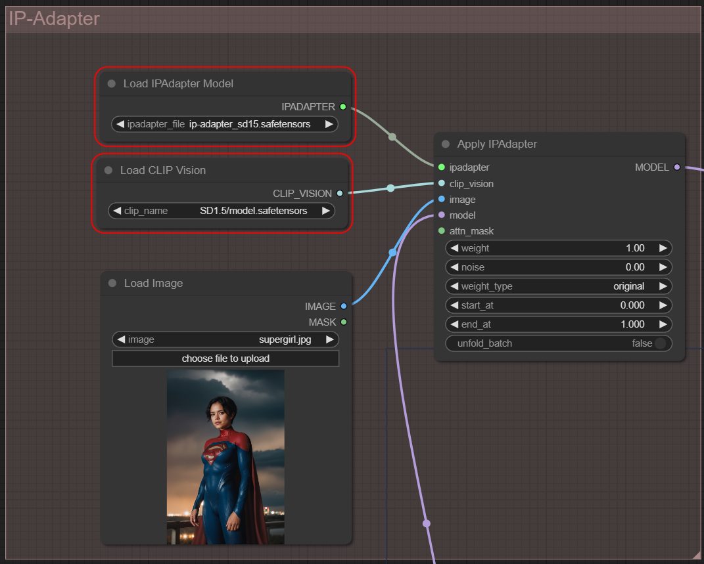

# Introduction
In this demo, I have developed a vid2vid diffusion pipeline to convert a person in a video to another character using ComfyUI.

# Development Envrionment
To generate this pipeline within a single day, the fastest solution was to utilize public model structures and pre-existing models.

### ComfyUI
Instead of using SDWebUI, which I am most familiar with, I chose ComfyUI for this project for the first time. Its UI design is superior for visualizing the structure of a complex pipeline, which could speed up development.

### ThinkDiffusion
To reduce the setup time for ComfyUI on a GPC instance with the correct settings, I utilized a service called ThinkDiffusion. It provides ComfyUI pre-configured on their instances. For this project, I selected their best instance, which has 32GB RAM and 24GB VRAM. However, I encountered multiple Out Of Memory (OOM) issues during development, and the video generation speed was still not ideal. Therefore, I reduced the video FPS from 26 (the original video) to 16 to generate quick demo videos.

# Components in the vid2vid diffusion pipeline
### Overview
The diagram below shows the entire vid2vid pipeline. I will explain each part in detail.

[ComfyUI Workflow JSON](vid2vid-workflow.json)

### SD1.5 img2img + LCM

Instead of using a direct vid2vid model, I choose to use SD1.5 img2img because it is easier to find public solutions and deploy.

The diagram below shows the basic SD1.5 img2img pipeline with [LCM-Lora](https://github.com/luosiallen/latent-consistency-model) to accelerate generation speed.

The number of inference steps has been reduced from 25 to 6 by using LCM, although the image quality has dropped compared to using the DPM++ SDE Karras sampling method. To develop and test this project as soon as possible, I chose to use LCM.

### AnimateDiff

Using SD1.5 img2img helps generate a style transfer image for every frame in the video, but it's challenging to maintain the context between frames to create a stable video. Therefore, we need an additional model to ensure the final output video looks stable. I chose [AnimateDiff](https://github.com/guoyww/AnimateDiff) to address this issue.

I adjusted the context length from 16 (default) to 24 (maximum) to generate as many frames as possible at once, and I changed the context overlap from 4 (default) to 6 (maximum) to help generate a smoother video.

### ControlNet

In order to maintain the posture identity from the original video, I used [ControlNet](https://github.com/lllyasviel/ControlNet). I experimented with three methods using three different ControlNet solutions: lineart, openpose, and dw-openpose. Using lineart largely restricts the texture of the clothes, making it difficult to generate a superhero's bodysuit in the output video because it uses the texture of the shirt from the input video. Using dw-openpose doesn't have this issue but offers less control over facial expressions since it doesn't track facial landmarks. To overcome these issues, I ultimately chose openpose.

### ReActor

To keep the face identity, I used [ReActor](https://github.com/Gourieff/comfyui-reactor-node), a user-friendly plugin built on [Deepfake](https://github.com/iperov/DeepFaceLab). It replaces the face in every frame of the diffusion pipeline output video with a reference face I cropped from the original video.

### SAM

To preserve the background of the original video, I used [SAM](https://github.com/facebookresearch/segment-anything) to automatically generate a segmentation mask for every frame in the original video. Then, the inpainting model only inpaints the region of the human mask without modifying the background, further preserving the video's identity.

### IP-Adapter

[IP-Adapter](https://github.com/tencent-ailab/IP-Adapter) is another tool I used to better maintain semantics between frames. It also offers a better way to control clothing details, which is difficult to achieve using text prompts alone.

Here are two demo videos using two different reference images in IP-Adapter.

### Ref Image 1: Super Girl

### Video Output

### Ref Image 2: Superwoman

### Video Output

### Fine-tuned model
Instead of using default SD 1.5 model, I choose to use a fine-tuned [Realistic Vision](https://civitai.com/models/4201?modelVersionId=130072) model from Civitai to generate videos with better photo-realisim.

# Output Demo
Here are two demo outputs showcasing the capabilities of my vid2vid diffusion pipeline with enhanced realism and stability in video generation.

[High-res Video (MP4)](demo_vids/AnimateDiff_00130.mp4)

[High-res Video (MP4)](demo_vids/AnimateDiff_00133.mp4)

# Area of Improvement
- Lighting harmonization
- Image Super-resolution
- Frame interpolation
- Lip movement (using wav2lip)
- Eyelid movement